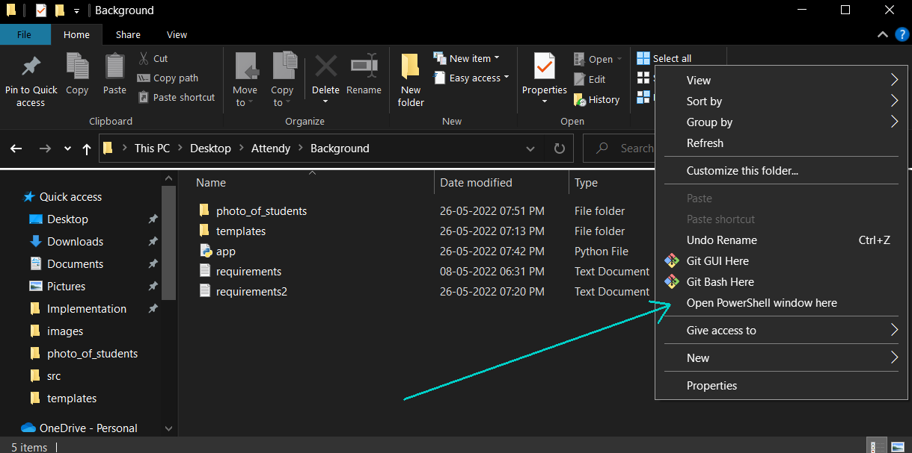
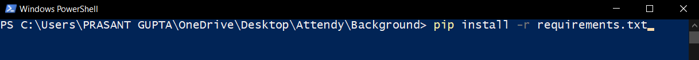
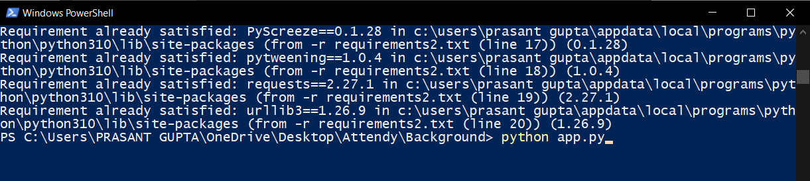
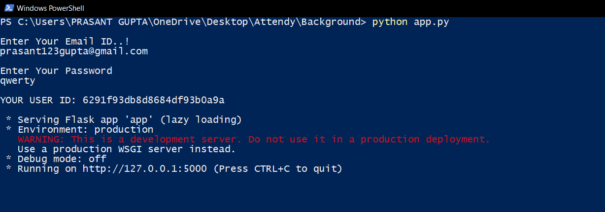

# Attendy-Background
This is the Background Directory Of Attendy


### 1) First make sure your device has the [python 3.10](https://www.python.org/downloads/) if not Download and install As the Program is not Compatible with lower version of python

Check the version of python by running command in CLI

```bash
python --version
```

### 2) Download the Background Directory From [Github](https://github.com/prasantgupta52/Attendy-Background) Or [Drive](https://drive.google.com/drive/folders/1mM41dwB-6cSmdGtNPo22yY9qO00wE_fI?usp=sharing)

### 3) After Downloading the Folder unzip the folder and Navigate to the unzipped folder

### 4) Inside the folder Hold ⇧ Shift and right-click any blank space in the folder. This displays a context menu next to your mouse cursor. As Shown Below in Picture
          

          
### 5) Click Open PowerShell window here. This opens the PowerShell inside the folder.

### 6) Now type "pip install -r requirements.txt" and hit enter this will take few minutes to complete. This is a one time Setup So it takes Few minutes Please Wait..

```bash
pip install -r requirements.txt
```


   
### 7) After completion type "python app.py" and hit enter wait few second.

```bash
python app.py
```
          

          
### 8) It will ask for your Email and Password which you used to SIgn-Up / Sign-In to Attendy. Email & Password is case sensitive so type carefully now hit enter and wait few seconds
 
### 9) If it shows running on http://127.0.0.1:5000 you are done and your application is running now do not close the powershell window or do not press Ctrl + C as it will  stop the application
         


### 10) Every Time You Update the Photos_of_students Folder by adding or removing Students Please Restart the Running Program By <br />
Stopping pressing (Ctrl + C)<br />
Starting Running (Python app.py)

### 11) Now you can use Attendy Seamlessly