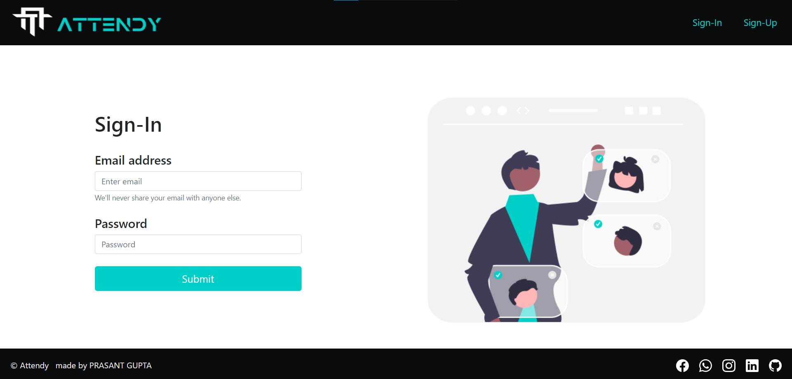
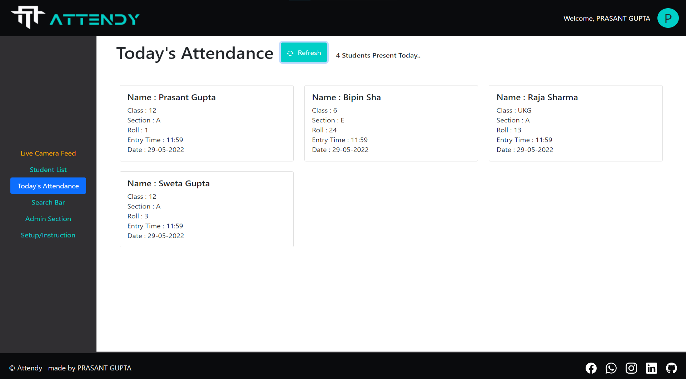
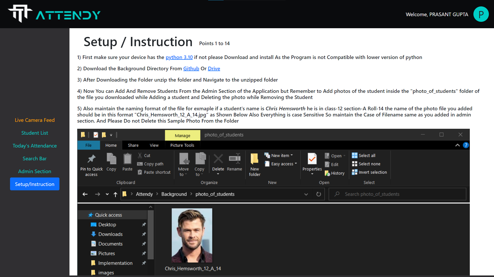

# Attendy

## Description

Attendy is a web based application with AI that automate the attendance record. It will  detect every face that came in the range of the camera and compare it with the all the Students Already Present in the System. Then it will automatically update the arrival (Mark Present) in the database. 

## Setup Of Application 

To run this application we have to do a required setup please refer to README.md in [Background Directory](Background) or you can also see the Setup/Instruction Section Of [Attendy](http://prasantgupta52.github.io/Attendy)

## Technologies Used

* **Front-End :** *ReactJs* 
* **Back-End API :** *Express.js* [Backend Directory](server)
* **Database :** *MongoDB*
* **AI Model :** [Python application](Background) using [Face-Recognition](https://face-recognition.readthedocs.io/en/latest/readme.html)
* **Pakage Manager** *Node Package Manager (npm) & Preferred Installer Program (pip)*
 

* **Front-End** is Hosted in Github Pages [Attendy](https://prasantgupta52.github.io/Attendy)
* **Backend-End** is Hosted in Heroku

## Features

* you can create your Account and Access the data from [Atteny](https://prasantgupta52.github.io/Attendy) from any device anywhere anytime
* you can Add or Remove Students From the Database Associated With Your Account
* you can Track Attendance Using The Live Camera Feed
* you can See the Whole List of Students in the Students List Section
* you can See Attendance of the Same Day from the Today's Attendance Section
* you can also see which Student Entered the class At what time (i.e. Entry Time)
* you can Search For Attendace In the Search Bar By Any data For example 
  First Name  
  Last Name  
  Class  
  Section  
  Roll  
  Date in proper format (DD-MM-YYYY)  
  or Even By Entering Multiple Fields Many Combinations are possible

### Made By Prasant Gupta

## Screenshots

* Sign-Up Page
 

 

* Sign-In Page
 

 

* Live Camera Feed Page
 

 

* Students List
 

 

* Today's Attendance
 

 

* Search Bar
 

 

* Admin Section
 

 

* Profile
 

 

* Setup/Instruction
 

